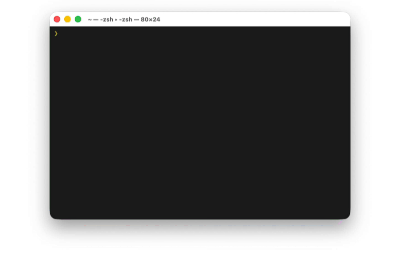

# zsh-terminal-profile 

Switch **macOS Terminal.app [profiles](https://support.apple.com/en-il/guide/terminal/trml107/2.15/mac/26)** directly from your Zsh shell.

Use color as context.  

Make **prod red**, **staging yellow**, **dev blue** — and switch instantly.

<p align="center">
  
</p>

> [!NOTE]
> Designed specifically for the built-in macOS **Terminal.app** (not iTerm2).

---

## Why?

If you use macOS **Terminal.app**, switching profiles normally requires opening Preferences or using the mouse.

That friction means most people don’t bother.

But profile color is powerful:

- 🔴 Production
- 🟡 Staging
- 🔵 Development
- 🟢 Local sandbox

Visual context reduces mistakes.

This plugin lets you change Terminal.app profiles from the command line — _fast_.

---

## Installation

### Oh My Zsh

```bash
git clone https://github.com/sfcodes/zsh-terminal-profile \
  ${ZSH_CUSTOM:-~/.oh-my-zsh/custom}/plugins/zsh-terminal-profile
```

Add to your `.zshrc`:

```bash
plugins=(... zsh-terminal-profile)
```

Reload:

```bash
source ~/.zshrc
```

## Usage

Type...
```bash
profile
```

Press **Tab** to autocomplete available Terminal.app profiles.

Or specify directly:

```bash
profile 'Red Sands'
profile 'Ocean'
```

## Preview Modes

Control how profile selection is displayed:

```bash
export ZSH_TERMINAL_PROFILE_PREVIEW=plain   # simple list
export ZSH_TERMINAL_PROFILE_PREVIEW=swatch  # color swatches (default)
export ZSH_TERMINAL_PROFILE_PREVIEW=live    # live preview
```

### Show profile details

Control whether to display profile details (font name, colors, etc.):

```bash
export ZSH_TERMINAL_PROFILE_DETAILS=0  # names only (default)
export ZSH_TERMINAL_PROFILE_DETAILS=1  # name, font, swatch, colors
```

---

## Example Workflow

```bash
profile 'Red Sands' # or better, create a profile named "prod"
ssh root@prod-server
```

Or create helpful aliases:

```bash
alias prod="profile 'Red Sands' && ssh prod-server"
alias staging="profile 'Man Page' && ssh staging-server"
alias dev="profile Ocean"
```

Color becomes a safety layer.

---

## How It Works

zsh-terminal-profile uses [AppleScript (osascript)](https://developer.apple.com/library/archive/documentation/AppleScript/Conceptual/AppleScriptLangGuide/introduction/ASLR_intro.html) to _tell_ Terminal.app to switch the current window’s profile.

No hacks.
No terminal replacement.
Just native macOS automation.

---

## Want More Profiles?

Terminal.app ships with a handful of built-in profiles, but you can install many more.
Check out [macos-terminal-themes](https://github.com/lysyi3m/macos-terminal-themes) for a large collection of color schemes ready to import into Terminal.app.

---

## Contributing

Issues and PRs welcome.

If you find this useful, consider starring the repo ⭐

---

## License

[BSD-3-Clause](LICENSE)

